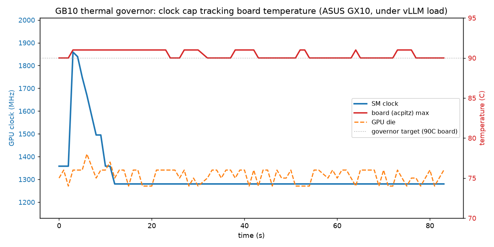

# GB10 Thermal Toolkit

Thermal tooling for NVIDIA GB10 "DGX Spark"-class mini systems (NVIDIA Founders,
**ASUS Ascent GX10**, MSI EdgeXpert, etc.). Some of these boxes hard power-off or
throttle under sustained GPU load. This toolkit helps you find out *why* yours runs
hot, and, once airflow is sorted, a small governor floats the GPU clock cap to hold
the board temperature in a safe band while running as fast as cooling allows.

## Read this first: check your fan direction

Before you blame the silicon, **verify the case fan is actually pulling air the right
way**. On at least one ASUS GX10 here the chassis fan was mounted **backwards**,
recirculating its own hot exhaust instead of exhausting it. The symptom was the classic
"GB10 cooks itself" picture: board (acpitz) hitting 94-96 C under load, one step from
the cutoff.

Flipping the fan to the correct direction dropped the board temperature by **~18 C** at
the *same* 2000 MHz clock:

| configuration | board (acpitz) under load |
|---|---|
| in case, fan **backwards** | 94-96 C |
| out of case (open air) | 74-77 C |
| in case, **fan corrected** | 77 C |

A corrected fan was as good as no case at all, and ~18 C cooler than the backwards fan.
That single fix turned a unit that tripped at 2000 MHz into one that sustains 2500+ MHz
at under 85 C with no cap at all. If your unit runs hot, this is the highest-value thing
to check, and it costs nothing. Many "defective, needs RMA" reports may simply be airflow.

## Is it really OCP? Probably not. It is cooling.

The community framing of these shutdowns as **over-current protection (OCP)** does not
survive measurement. Logging `power.draw`, `clocks_throttle_reasons.*`, and the board
zones through a real trip shows:

- **Power is never the limiter.** Peak draw under heavy vLLM prefill was ~49 W at
  2000 MHz and ~65 W at 2300 MHz, against a module budget on the order of ~140 W. The
  board can sit at 93 C while the GPU pulls only ~19 W. You cannot over-*current* at
  19 W, and `clocks_throttle_reasons.hw_power_brake_slowdown` (the flag a real power/
  brownout event would set) never fired.
- **It is thermal, specifically cooling-capacity-limited.** The board holds 93-96 C even
  at low GPU power because the heat cannot be removed fast enough (see: backwards fan).
  Raising the clock barely raises power (the workload is memory-bandwidth-bound, so the
  compute units idle-wait on memory at ~95% "util" while drawing little), but it does add
  heat the marginal cooling cannot shed, walking the board into the cutoff.

So the lever that matters is **airflow first, clock cap second**. The cap is a way to
trade a little speed for thermal margin on a unit you cannot (yet) cool properly; it is
not a fix for an over-current fault that, on the units measured here, was not happening.

That said: genuinely defective units exist (failed fan, bad sensor; some fail NVIDIA's
FieldDiag PowerStress and route to RMA). If a corrected fan and an open bench still trip
at a low cap, then yours may be one.

## What you cannot do on GB10

- No OS fan control (the embedded controller owns the fan curve; NVIDIA confirmed).
- No reliable fan-RPM read (no `hwmon` fan input, no PWM, no BMC/IPMI; the lone
  `acpi_fan` value is coarse/stuck). See [`FAN_MONITORING.md`](FAN_MONITORING.md) for the
  full recon (ACPI, device tree, hwmon, SCMI, I2C all checked) plus the EC-firmware
  reverse-engineering route. Run [`recon-fan.sh`](recon-fan.sh) to check your own unit.
- No power cap (`nvidia-smi -pl` is N/A).
- No `devfreq`/sysfs GPU frequency node. The graphics-clock cap via `nvidia-smi -lgc`
  (root only) is the single software lever.

## What sysfs *does* give you

- **Board temp: native.** The hottest `acpitz` zone is at
  `/sys/class/thermal/thermal_zone*/temp`. This is the trip driver and needs no
  nvidia-smi, so the governor reads it directly and polls fast.
- **GPU die temp: nvidia-smi only** (no thermal-zone/hwmon node for it). Not needed for
  governing, since the board is what trips.
- **Clock set: nvidia-smi `-lgc` only**, and it needs real root.

## What is in here

| file | what it does |
|---|---|
| `gpu-thermal-governor.sh` | Closed-loop governor. Reads the hottest **board/acpitz** zone natively from sysfs, floats the clock cap to hold it in a target band (step down hot, up cool), with a hard panic drop near the cutoff. Boosts toward the ceiling on a well-cooled unit. |
| `gpu-thermal-log.sh` | Logs `util / gpu temp / power / sm clock / board zones` to the journal once a minute, but only when the GPU is active (util above a threshold). |
| `systemd/nvidia-gb10-clock-cap.service` | Static clock cap applied at boot (a safe floor before the governor takes over). |
| `systemd/gpu-thermal-log.service` + `.timer` | Run the thermal logger every minute. |
| `deploy-docker.sh` | Deploy the governor as an auto-restarting container. |

## Key insight: watch the board, not the GPU

The trip is driven by the **board / Grace-CPU** sensor, which runs ~10 C hotter than the
GPU die. Governing on GPU temperature alone is not enough: the GPU can read a comfortable
84 C while the board sits at 95 C, one step from the cutoff. This governor controls on the
hottest board zone.

## Closed-loop behaviour

The governor floats the clock cap between `MIN_CLK` and `MAX_CLK` to hold the board in a
target band. On a well-cooled unit (corrected fan, open bench) it rides near the ceiling;
on a marginal one it settles low. A fast poll (default 3 s, cheap because the board read
is native sysfs) plus a panic threshold catches the quick board spikes that prefill/
compute bursts cause. Sample run on an ASUS GX10 under a vLLM benchmark:



## Install

### Option A: native systemd (recommended; clock-set needs root)

```bash
sudo cp gpu-thermal-governor.sh gpu-thermal-log.sh /usr/local/bin/
sudo chmod 755 /usr/local/bin/gpu-thermal-governor.sh /usr/local/bin/gpu-thermal-log.sh
sudo cp systemd/*.service systemd/*.timer /etc/systemd/system/
sudo systemctl daemon-reload
sudo systemctl enable --now gpu-thermal-governor.service    # dynamic governor
sudo systemctl enable --now gpu-thermal-log.timer           # periodic thermal log
```

Watch it:

```bash
journalctl -u gpu-thermal-governor -f       # cap changes
journalctl -u gpu-thermal-log.service -f    # periodic thermals
```

### Option B: unprivileged + passwordless sudo

`nvidia-smi -lgc` needs root. If you would rather run the governor as your user, grant
passwordless sudo for nvidia-smi and start it with `SMI="sudo -n nvidia-smi"`:

```bash
SMI="sudo -n nvidia-smi" ./gpu-thermal-governor.sh
```

Note: setting the clock requires *real* host root. A container (even `--privileged`,
`--gpus all`) cannot change the clock: GB10 rejects the call from a namespaced root.

## Tuning

Governor knobs (env vars, with defaults):

| var | default | meaning |
|---|---|---|
| `MAX_CLK` | 3003 | ceiling MHz (stock max; lower it to force a hard cap) |
| `MIN_CLK` | 1500 | floor MHz |
| `ZONE_HI` / `ZONE_LO` | 91 / 87 | board (acpitz) step-down / step-up thresholds (C) |
| `ZONE_PANIC` | 94 | board temp at which to slam straight to the floor |
| `STEP` | 150 | MHz per adjustment |
| `INTERVAL` | 3 | poll seconds |
| `SMI` | `nvidia-smi` | set to `sudo -n nvidia-smi` to run unprivileged |

Once airflow is correct, most units sit near the ceiling and the cap rarely engages.
On a still-marginal unit, reported-working static caps from the community range
2000-2300 MHz (2200 is a common sweet spot). Performance loss for LLM inference is small
either way, because GB10 is memory-bandwidth-bound, not clock-bound: the clock mainly
affects compute-bound prefill, not memory-bound decode.

If your unit still powers off with a corrected fan and a 2000 MHz cap, it is likely
defective: RMA it.

## Notes

- The clock cap is set with `nvidia-smi -lgc 0,<MHz>` and persists while persistence mode
  is on (`nvidia-smi -pm 1`).
- After a thermal power-off a unit can latch into a stuck low-power state (~14 W, 0% util);
  disconnect power for ~5 minutes to reset the controller.
- Always use the supplied power adapter; others can cause shutdowns.
- The governor process is a few MB, leak-free (scalar-only loop), `timeout`-guarded
  against a hung `nvidia-smi`, and self-restarts cleanly once a day.

## References

- NVIDIA dev forum, shutdown-under-load / RMA threads (the canonical ones):
  - https://forums.developer.nvidia.com/t/to-nvidia-staff-is-this-a-hardware-issue-requiring-repeated-shutdowns-and-rma-under-high-load/362775
  - https://forums.developer.nvidia.com/t/dgx-spark-gb10-reproducibly-hard-powers-off-under-gpu-load-fully-updated-zero-crash-capture/373251
  - ASUS GX10 under vLLM: https://forums.developer.nvidia.com/t/title-asus-ascent-gx10-gb10-hard-power-off-unclean-reboot-under-vllm-gpt-oss-120b-long-context/359785
- Idle thermal anomaly / fan not spinning: https://forums.developer.nvidia.com/t/dgx-spark-gb10-fan-not-spinning-80-c-at-idle-with-0-gpu-utilization/370080
- PowerStress thermal-sensor FAIL -> RMA: https://forums.developer.nvidia.com/t/dgx-spark-fielddiag-powerstress-fail-mods-020000600139-thermal-sensor-requesting-rma/373266
- No OS fan control: https://forums.developer.nvidia.com/t/fan-control-from-the-os/360020
- Clock-cap writeup: https://www.wildpines.ai/blog/your-dgx-spark-is-cooking-itself/
